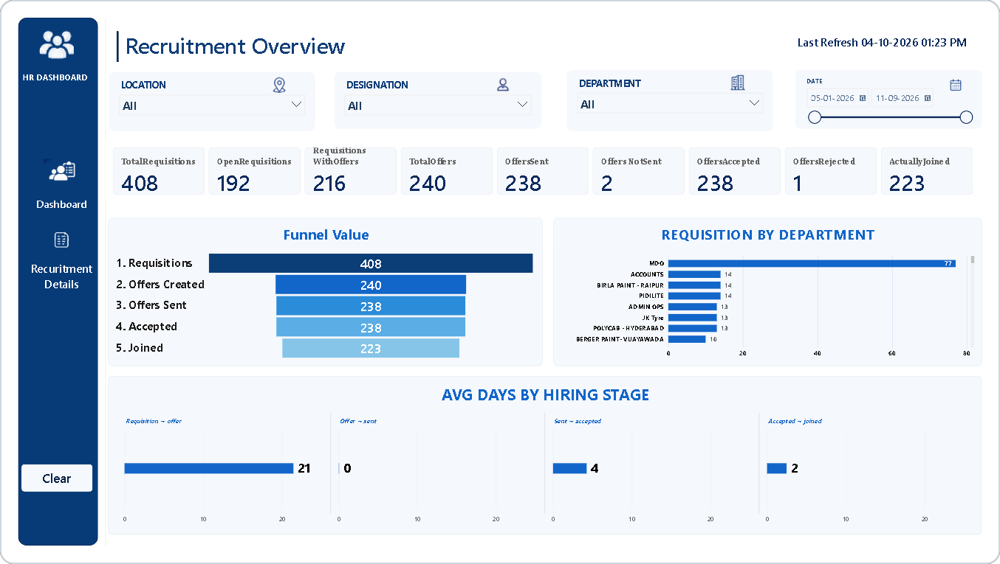

<a id="readme-top"></a>

<div align="center">

# Recruitment Funnel & Hiring Analytics Dashboard

**An interactive Power BI dashboard that tracks the full hiring journey, from requisition to joining, and shows where time and candidates are lost.**


[**📥 Download the .pbix**](Recruitment%20Funnel%20%26%20Hiring%20Analytics%20Dashboard.pbix) · [**💡 Key Insights**](#-key-insights) · [**📊 Walkthrough**](#-dashboard-walkthrough)

<br />



</div>

<br />

<details>
<summary><b>📑 Table of Contents</b></summary>

- [Project Overview](#-project-overview)
- [Key Insights](#-key-insights)
- [Dashboard Walkthrough](#-dashboard-walkthrough)
- [KPIs](#-kpis)
- [Data Model](#-data-model)
- [Tools Used](#-tools-used)
- [How to Open](#-how-to-open)
- [Repository Structure](#-repository-structure)
- [Future Enhancements](#-future-enhancements)
- [Author](#-author)

</details>

## 📌 Project Overview

Recruitment teams juggle hundreds of open positions at once, which makes it hard to see how many are turning into hires, which departments drive demand, and where the process slows down. This Power BI report turns raw recruitment data into a single interactive view of the entire hiring funnel.

It answers four business questions:

- How many requisitions are converting into offers and hires?
- Where do candidates drop off in the funnel?
- Which departments raise the most hiring demand?
- How long does each stage of the hiring process take?

The dataset covers **408 requisitions** raised between **January and September 2026**.

## 💡 Key Insights

- **Just over half of demand has converted.** 216 of 408 requisitions (52.9%) have reached the offer stage, while 192 (47.1%) are still open.
- **Offers are almost always accepted.** 238 offers were sent and 238 accepted, with only 1 rejection recorded.
- **The real drop-off happens after acceptance.** 15 candidates (6.3%) accepted an offer but never joined, leaving **223 hires**, a 54.7% requisition-to-hire rate.
- **Requisition → Offer is the bottleneck.** It takes **21 days** on average, about 78% of the ~27-day hiring cycle. Once an offer is created it's sent the same day, accepted within ~4 days, and the candidate joins ~2 days later.
- **MDO drives hiring demand.** With 77 requisitions (18.9% of the total), MDO raises 5.5× more requisitions than the next-highest departments, which have 14 each.

### 🎯 Recommendations

- **Speed up sourcing and screening.** Cutting days from the Requisition → Offer stage has the biggest impact on time-to-hire.
- **Engage candidates before they join.** Regular check-ins between acceptance and joining day can reduce the 6.3% post-acceptance drop-off.
- **Plan recruiter capacity for MDO,** which accounts for roughly 1 in 5 requisitions.

## 📊 Dashboard Walkthrough

### Page 1: Recruitment Overview

| Visual | What it shows |
| --- | --- |
| **KPI cards** | Nine headline metrics, from total requisitions to candidates who actually joined |
| **Funnel Value** | How volume narrows from requisitions → offers created → sent → accepted → joined |
| **Requisition by Department** | Which departments raise the most hiring demand |
| **Avg Days by Hiring Stage** | Average number of days between each step of the hiring process |
| **Slicers** | Filter the whole page by Location, Designation, Department and Date range |
| **Side navigation** | Switch between pages, plus a one-click **Clear** button that resets every filter |
| **Last Refresh** | Shows when the data was last updated |

### Page 2: Recruitment Details

A detailed view of the recruitment records behind the overview, reachable from the side navigation.

<!-- Tip: add a screenshot of this page too. Upload it as recruitment-details.png and uncomment the line below.

-->

## 📈 KPIs

| KPI | Value | Definition |
| --- | ---: | --- |
| Total Requisitions | 408 | All hiring requests raised |
| Open Requisitions | 192 | Requisitions that have no offer yet |
| Requisitions with Offers | 216 | Requisitions that reached the offer stage |
| Total Offers | 240 | Offers created (one requisition can have several) |
| Offers Sent | 238 | Offers sent to candidates |
| Offers Not Sent | 2 | Offers created but not yet sent |
| Offers Accepted | 238 | Offers accepted by candidates |
| Offers Rejected | 1 | Offers declined by candidates |
| Actually Joined | 223 | Candidates who joined after accepting |

<sub>Values shown for the full date range with no filters applied.</sub>

## 🧩 Data Model

| Table | Purpose |
| --- | --- |
| `Sheet1` | Main recruitment dataset: requisitions, offers, stage dates, location, designation and department |
| `FunnelStages` | Helper table that defines and orders the stages in the funnel visual |
| `CycleStages` | Helper table that defines the stage pairs in the *Avg Days by Hiring Stage* visual |

## 🧰 Tools Used

| Tool | Used for |
| --- | --- |
| **Power BI Desktop** | Report design, interactivity and page navigation |
| **Power Query** | Importing and preparing the data |
| **DAX** | Measures behind every KPI card and chart |
| **Excel** | Source dataset |

**Skills demonstrated:** funnel analysis · KPI design · data modeling · DAX · dashboard UX · data storytelling

## 🚀 How to Open

1. Download [`Recruitment Funnel & Hiring Analytics Dashboard.pbix`](Recruitment%20Funnel%20%26%20Hiring%20Analytics%20Dashboard.pbix) from this repository.
2. Open it in [Power BI Desktop](https://powerbi.microsoft.com/desktop/) (free).
3. Use the slicers and the side navigation to explore the data.

> [!NOTE]
> Power BI Desktop runs on Windows only. On a Mac, use a Windows virtual machine, or open the report in the Power BI Service (requires a work or school account).

## 📁 Repository Structure

```text
├── Recruitment Funnel & Hiring Analytics Dashboard.pbix   # Power BI report
├── dashboard.png                                          # Dashboard preview shown above
└── README.md                                              # Project documentation
```

## 🔮 Future Enhancements

- Monthly trends for requisitions, offers and time-to-hire
- Source-of-hire and recruiter performance analysis
- Publish to the Power BI Service with scheduled refresh

## 👤 Author

Built by **[@Inder616](https://github.com/Inder616)**. Feedback and suggestions are always welcome!

<!-- Replace YOUR-LINKEDIN-ID below with your LinkedIn profile ID -->
[](https://github.com/Inder616)
[](www.linkedin.com/in/inder-sinha)

---

<div align="center">

**If you found this project useful, please give it a ⭐**

<a href="#readme-top">↑ Back to top</a>

</div>
